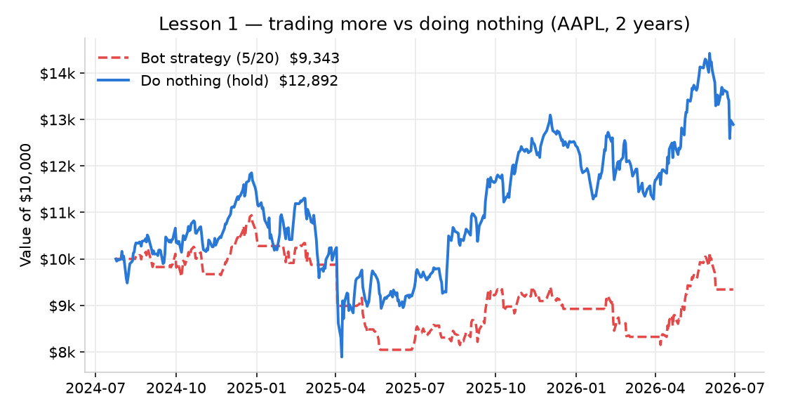
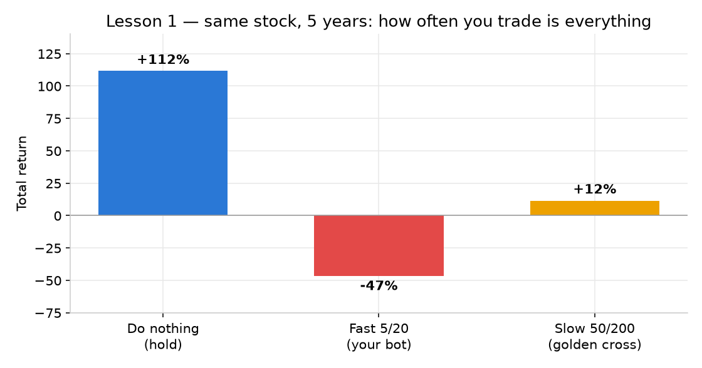
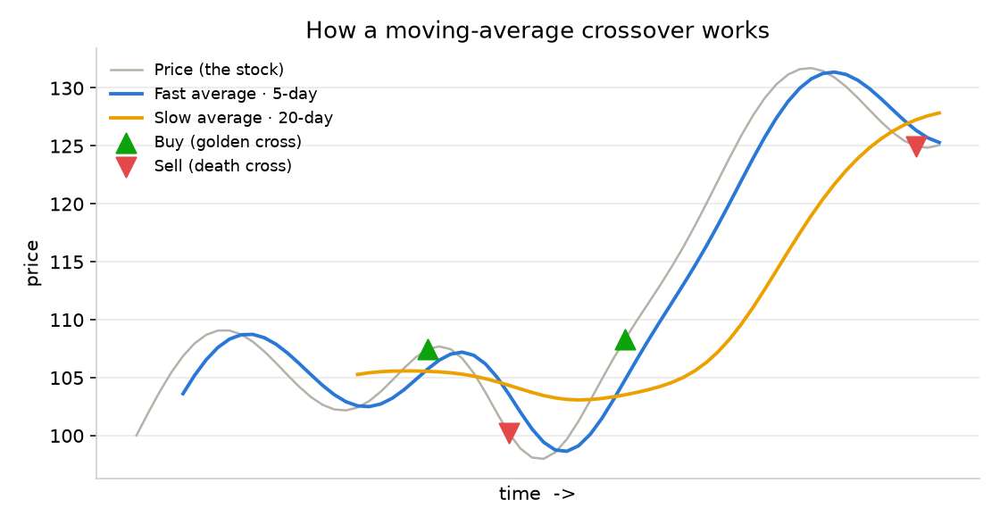
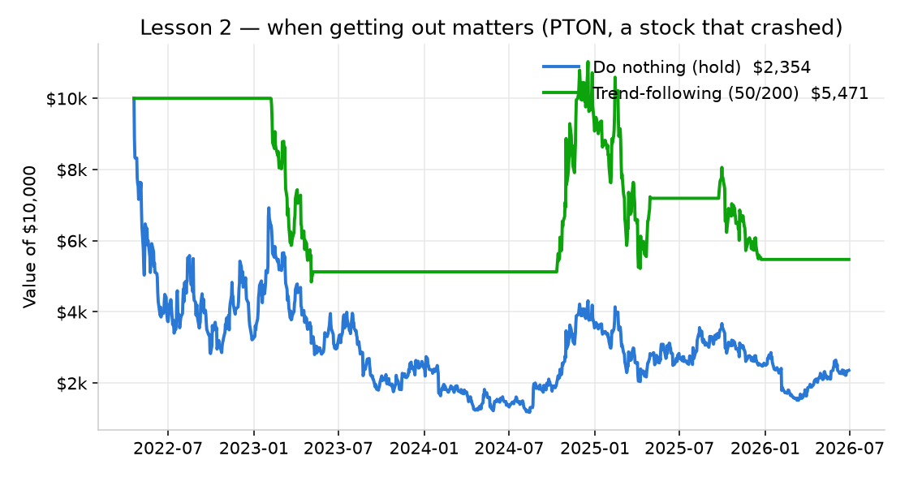
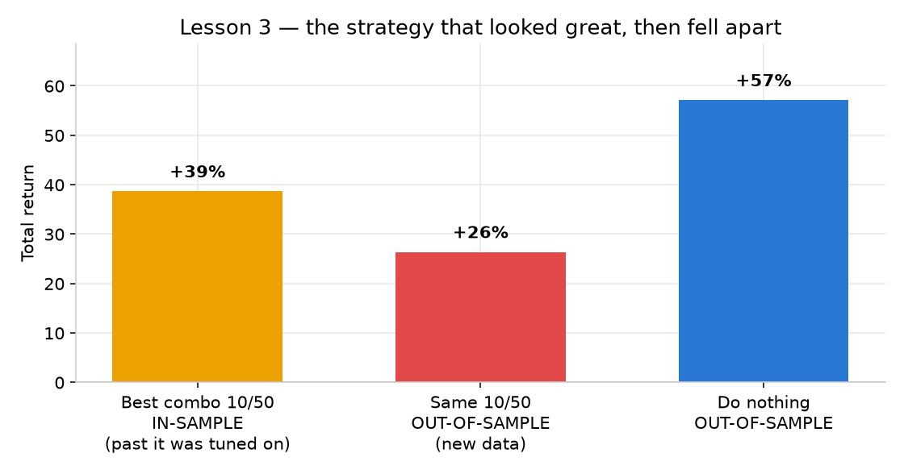
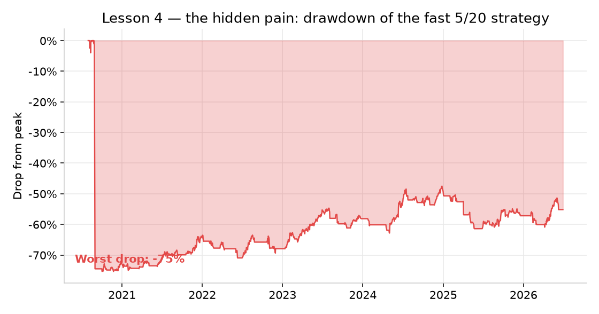
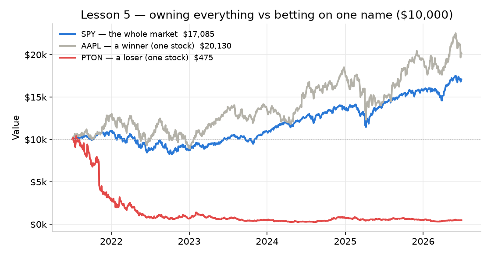
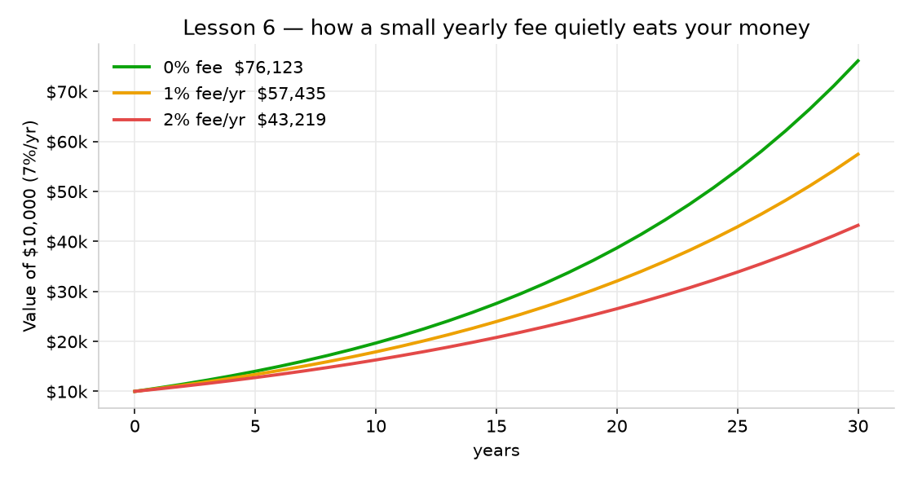
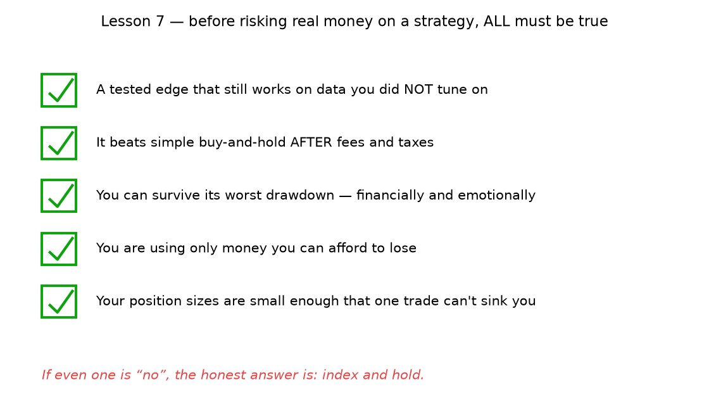
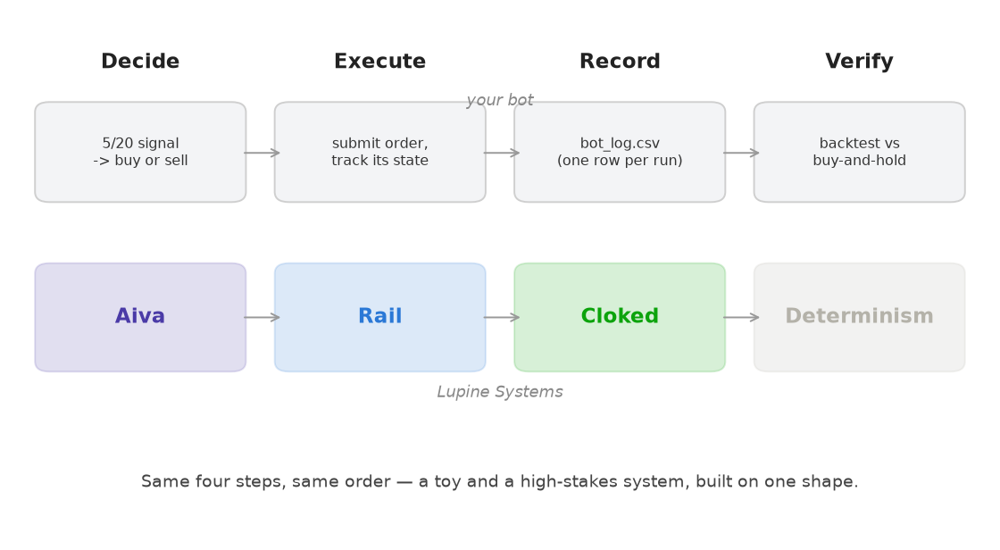

# Markets, Honestly — A Field Manual

### A plain-English course in 8 lessons · tied to Aiva · Rail · Cloked

## How to use this manual

This is a plain-English course that turns your Cadence trading bot into a way to understand markets — and, at the same time, the thinking behind your Lupine Systems project. You never need to write code. You bring the questions; the experiments are run for you on real market data.

The deal:

- You are the strategist; the code is the instrument. Ask in plain English ("what if it traded less?") and the experiment gets run for you.
- Every claim here is tested on real data (AAPL, PTON, SPY via Alpaca) and benchmarked against simply doing nothing.
- Everything runs on paper money. Nothing in this manual risks a real cent.

How each lesson is laid out — the same four parts every time:

- The market truth — the plain-English lesson.
- The chart — the proof, on real prices.
- The Lupine bridge — how that lesson maps to Aiva, Rail, or Cloked.
- The takeaway — one line worth remembering.

How to actually learn from it — the routine that turns reading into understanding:

- Daily (5 min): read the newest line in bot_log.csv and say out loud what the bot did and why.
- Weekly (20 min): change ONE setting in the backtest, predict what will happen, then run it and compare.
- Always: benchmark against buy-and-hold, and never trust a result you cannot reproduce on fresh data.
- Keep a journal: "I changed X, I predicted Y, I got Z, because…". Prediction-before-result is where understanding forms.

The course has three modules and eight lessons:

- Module A (Lessons 1–4) — how markets really behave.
- Module B (Lessons 5–7) — the honest path to real money.
- Module C (Lesson 8) — bring it home: your bot and Lupine are the same machine.

> 🔑 **Takeaway:** Keep it on paper money until your understanding is well ahead of your confidence. This manual is education, not financial advice.

---

# Module A — How markets really behave

## Lesson 1 — Activity is a cost

The most expensive instinct in trading is the urge to do something. Your bot's strategy traded 30 times over two years and lost money, while simply buying once and holding did nothing and won comfortably.

*Your bot (5/20) ended at $9,343. Doing nothing ended at $12,892. Same stock, same two years.*

Why does action cost so much? Whipsaw (buying high and selling low as the signal flips), being in cash during the best rebounds, and — in the real world — fees, the bid/ask spread, and taxes on every trade. Action has a price tag; inaction is free.

Stretch it to five years and the pattern becomes overwhelming. The only thing that changes between these three is how often the strategy acts:

*Do nothing: +112%. Slow strategy (9 trades): +12%. Fast strategy (82 trades): −47%. Less action, far better outcome.*

Trading less helped enormously — the slow strategy beat the fast one by a mile. But notice: even the disciplined, trade-rarely strategy still lost badly to doing nothing. On an asset that mostly rises and recovers, no trend rule beats holding, because to follow a trend you must sometimes sell — and every time you are out, you risk missing the rebound that makes the money.

> **Lupine bridge → Aiva** — Aiva's whole job is to decide whether and how value should move. The smartest router always keeps "don't move / hold" as a candidate option, and only acts when acting genuinely beats holding. A bot that trades on every signal is a router that moves value on every request — it bleeds value to friction. Earn the right to act.

> 🔑 **Takeaway:** Doing nothing is a strategy, and usually a strong one. Every action must beat it, or you should not take the action.

## Reference — how a moving-average crossover works

A moving average (MA) is just the average price over the last N days, recalculated daily; it smooths out the noise so you can see the direction. A fast MA uses a short window and reacts quickly; a slow MA uses a long window and reacts slowly. Your bot watches a fast 5-day and a slow 20-day average — that is what "5/20" means.

*When the fast line crosses above the slow line it is a golden cross (buy). When it crosses below, a death cross (sell). The choppy middle, where it sells low then buys back higher, is whipsaw.*

## Lesson 2 — When trading earns its keep

If trend-following always loses to holding, why does anyone use it? Because not every asset goes up forever. Buy-and-hold only wins when the asset recovers. Here is PTON, which peaked near $126 and fell to under $6 — and never came back.

*Holding turned $10,000 into $2,354 (−76%). Trend-following (50/200) turned it into $5,471 (−45%) — it got you out and preserved more than twice as much.*

Be honest about what happened: trend-following still lost money on PTON. But it lost far less, because the death cross pulled it out to cash partway down and kept it out. That is the point — trend-following is not a profit engine, it is insurance against ruin. It shines in exactly the situation where buy-and-hold is a catastrophe.

> **Lupine bridge → Aiva (exposure & failure risk)** — Aiva does not only score cost and speed — it scores the risk of getting it wrong. A route that is slightly cheaper but exposes you to ruin is not a winner. PTON is the corridor that fails; the value of a good decision layer is knowing when to stop sending value down it.

> 🔑 **Takeaway:** Trend-following is insurance, not income. Judge it by the disasters it helps you avoid, not by whether it beats a winner.

## Lesson 3 — Why most strategies fail (and how not to fool yourself)

It is dangerously easy to find a strategy that looks brilliant on past data. We tried eight different MA combinations on the first half of AAPL's history and kept the best one (a 10/50 crossover, up 39% on that stretch). Then we ran that exact "winning" combo on the second half — fresh data it had never seen.

*The combo that looked best on its tuning data (+39%) degraded to +26% on fresh data — and still lost to doing nothing (+57%). Tuning to the past does not transfer to the future.*

This is overfitting: tuning a strategy so tightly to past data that it memorises noise instead of learning a real pattern, then collapses on new data. The cure is simple and strict — always test on data you did not tune on ("out-of-sample"), and be suspicious of any backtest that looks too good.

> **Lupine bridge → Cloked** — Cloked exists so a decision can be checked, not just claimed. The same discipline protects you here: keep an honest, reproducible record, and never fake depth. A result you cannot reproduce on fresh data is not evidence — it is a story.

> 🔑 **Takeaway:** Always benchmark against doing nothing, always test on data you did not tune on, and distrust results that look too good.

## Lesson 4 — Risk before reward

Returns are what you brag about; drawdown is what makes you quit. Drawdown is the worst drop from a previous peak — how much pain you had to sit through. Here is the fast 5/20 strategy's pain over five years:

*The fast strategy put you through a 75% drop from its peak. Most people abandon a strategy long before that — which locks in the loss.*

Two defences. First, position sizing: never put everything on one bet. Your bot buys just $10 at a time in fractional shares — intentionally tiny, so no single trade can hurt you. Second, ask "how much can I lose?" before "how much can I make?". A strategy you cannot emotionally survive is not a strategy you own.

> **Lupine bridge → Rail** — Rail is the layer of safety switches and validated steps — nothing moves except through allowed transitions. Your bot's paper=True flag and small fixed bet size are exactly that: hard guardrails that cap the damage of any single decision.

> 🔑 **Takeaway:** Decide what you can afford to lose first. Survival comes before profit.

---

# Module B — The honest path to real money

## Lesson 5 — Diversification: don't pick needles, buy the haystack

Lessons 1–4 were about a single stock. But here is the deeper problem: you cannot know in advance which stock is the next AAPL and which is the next PTON. Picking one is a bet on being right about the future — and most people aren't.

*From 2021: PTON (a loser) collapsed to $475. AAPL (a winner) rose to $20,130. SPY — the whole market — returned a steady $17,085, with no risk of picking the disaster.*

A broad index fund owns a tiny slice of hundreds or thousands of companies at once. You stop trying to pick the winner and simply capture the market's average. You give up the fantasy of owning only AAPL — but you also become immune to the nightmare of owning only PTON. For almost everyone, that trade is overwhelmingly worth it.

> **Lupine bridge → Aiva (spread the risk)** — Aiva never sends all the value down a single corridor it is unsure about — it spreads exposure so no single failure is fatal. Diversification is that same instinct, applied to your savings: never let one bad bet end the game.

> 🔑 **Takeaway:** Don't try to pick the needle. Buy the whole haystack, and hold it.

## Lesson 6 — Fees, taxes & friction: the silent leak

Every time you act, you pay — a broker fee, the bid/ask spread, and tax on any gain. Even a fund's small yearly fee looks harmless. It is not. Costs compound against you exactly the way returns compound for you.

*$10,000 growing at 7% a year for 30 years. With no fee: $76,123. A 1% yearly fee quietly removes 25% of your final wealth; a 2% fee removes 43% — for doing nothing different.*

Notice you did nothing differently across all three lines — same returns, same patience. The only difference is the leak. This is why a boring, low-cost index fund beats an exciting, high-fee actively managed fund so reliably: it stops the leak. And every extra trade you make piles its own friction and tax on top.

> **Lupine bridge → Aiva (the cost term)** — In Aiva's scoring, cost is not an afterthought — it is decomposed and counted in full (spread, fees, slippage). The lesson is identical: the cost of moving value is real and compounding, so minimise it — it is the one part of your return you actually control.

> 🔑 **Takeaway:** Minimise cost and turnover. It is the most reliable edge available to anyone.

## Lesson 7 — When active trading actually makes sense

So is active trading ever justified? Rarely — and only when a strict checklist is ALL true:

*Every box must be ticked. If even one is "no", the honest answer is to index and hold.*

Notice what this rules out: trading because it's exciting, because a chart "looks like" a pattern, because you have a hunch, or because you want to get rich fast. Those are the exact reasons most people lose. A real edge is tested, survives fresh data, beats doing nothing after costs, and is sized so it cannot ruin you.

> **Lupine bridge → Aiva (the full decision)** — This is Aiva's complete utility in plain English: only move when the expected gain genuinely clears cost AND risk. Most of the time, for most assets, it does not — so the correct decision is to hold. Acting is the exception you must earn, not the default.

> 🔑 **Takeaway:** The bar for trading real money is very high. If you can't clear every item, index and hold — that's not failure, it's wisdom.

---

# Module C — Bring it home

## Lesson 8 — The whole loop is Lupine (capstone)

Step back and look at everything you've built. Your bot does four things, in order: it decides (a signal), executes (an order), records (the log), and trusts only what it has verified (the backtest). That is not a coincidence — it is the same loop your Lupine Systems project is built on.

*The four steps map one-to-one: Decide = Aiva, Execute = Rail, Record = Cloked, Verify = the determinism value underneath. A $10 toy and a high-stakes system, built on one shape.*

Lupine is the serious, high-stakes version: deciding how value moves across borders when getting it wrong is expensive. Your trading bot is the safe practice ground for the exact same disciplines — score honestly, execute with guardrails, keep tamper-proof records, and trust only what you can reproduce. Every lesson in this manual was, quietly, a lesson in how to think about Lupine.

> **Lupine bridge → Aiva · Rail · Cloked** — Aiva (decide), Rail (execute), Cloked (record), and determinism (verify). You now think in the same four-step shape as the system you're building — which was the whole point of using the bot as a learning lab.

> 🔑 **Takeaway:** You don't just have a trading bot. You have a working, hands-on model of how Lupine itself thinks.

## Glossary

| Term | Plain English |
|---|---|
| Moving average (MA) | The average price over the last N days, recalculated daily. Smooths noise to reveal direction. |
| Fast / slow MA | Fast = short window, reacts quickly. Slow = long window, reacts slowly. |
| 5/20, 50/200 | The two window lengths of a strategy: a fast MA paired with a slow MA. 50/200 trades far less often than 5/20. |
| Crossover | The moment the fast line crosses the slow line — the buy/sell trigger. |
| Golden cross | Fast crosses above slow → bullish → buy. |
| Death cross | Fast crosses below slow → bearish → sell. |
| Whipsaw | Crosses flipping back and forth in choppy markets, causing losing buy-high/sell-low trades. |
| Buy-and-hold | The "do nothing" benchmark: buy once, never sell. The bar every strategy must beat. |
| Backtest | Replaying a strategy on past prices to see how it would have done — testing before risking money. |
| Drawdown | The worst peak-to-bottom drop along the way. Measures pain and risk, not just final return. |
| Overfitting | Tuning a strategy so tightly to past data that it fails on new data. |
| In-sample / out-of-sample | Data you tuned on / fresh data you did not. A strategy must work out-of-sample to be real. |
| Position sizing | How much you put on a single trade. Small sizes cap the damage of being wrong. |
| Trend-following | Betting that a move continues (your bot). Insurance against assets that fall and stay down. |
| Mean-reversion | The opposite bet: that what moved too far snaps back. |
| Diversification | Owning many things at once so no single failure can ruin you. |
| Index fund | A fund that owns a whole market at once, cheaply. Captures the average instead of picking. |
| Expense ratio / fee | The yearly cut a fund takes. Small numbers compound into large losses over time. |
| Compounding | Growth on growth. It works for returns — and, via fees, against you. |
| Edge | A real, tested advantage that beats doing nothing after costs. Rare, and easy to imagine you have. |

## Where to go from here

- Run experiments yourself — you direct, the code runs. Change one variable, predict, then check.
- Always benchmark against doing nothing, and test on data you did not tune on.
- For real money, the honest default is a broad, low-cost index fund held for years — that's Lessons 5 and 6, not the bot.
- Keep the bot on paper as your learning lab, and revisit any lesson whenever you like.

This manual is educational only and is not financial advice. The bot trades paper (fake) money by design. Keep it that way until your understanding is well ahead of your confidence.
